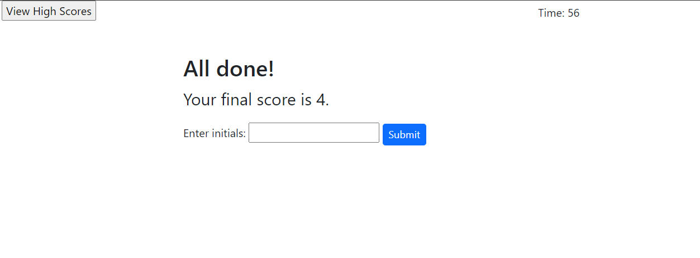
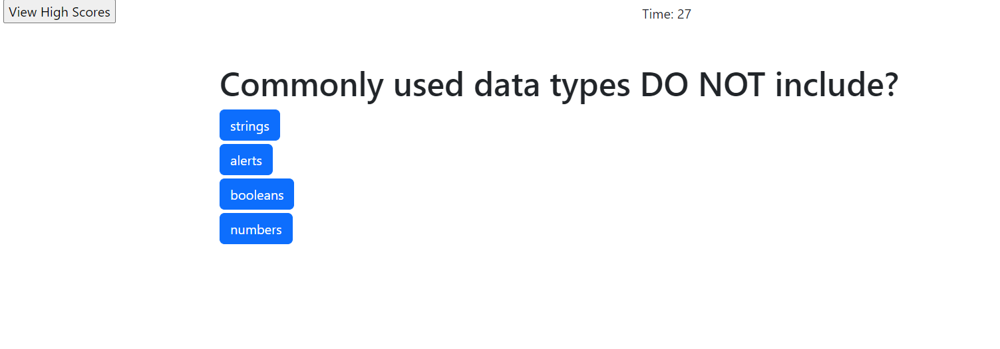
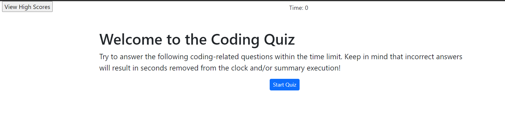

# challenge-4-code-quiz

This is the fourth coding challenge. It is an app to help me review and study my course materials.

## Installation

Deploy using GitHub pages.

## Mockup

The deployed app will look like these images

## GitHub url
https://github.com/mrjakeschultz/challenge-4-code-quiz

## Deployment url
https://mrjakeschultz.github.io/challenge-4-code-quiz
